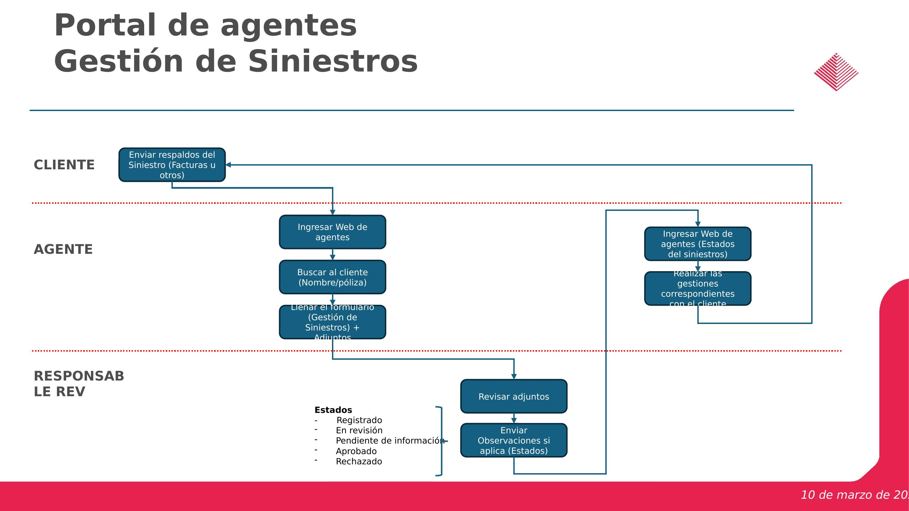
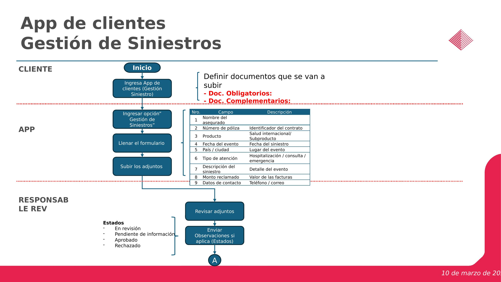
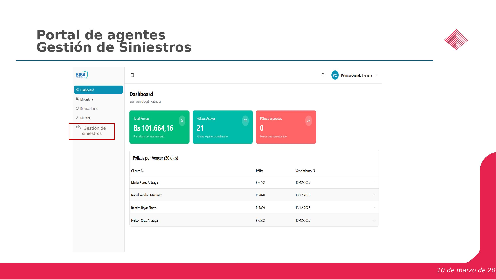
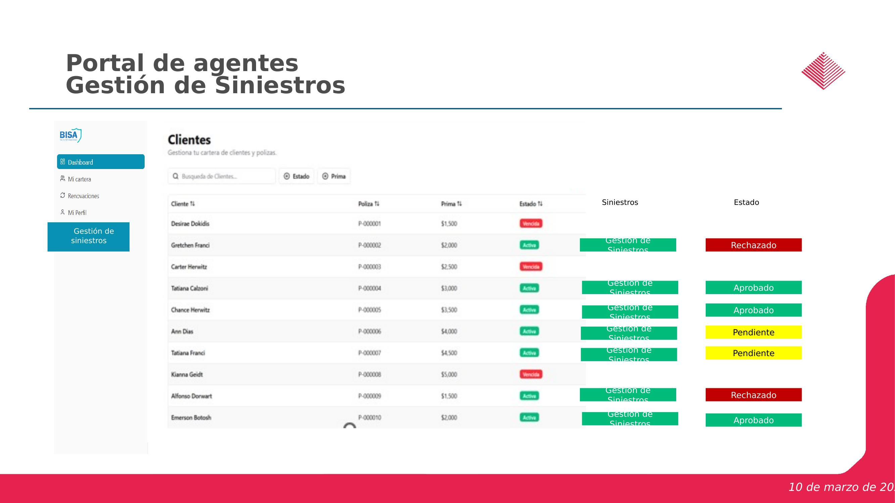
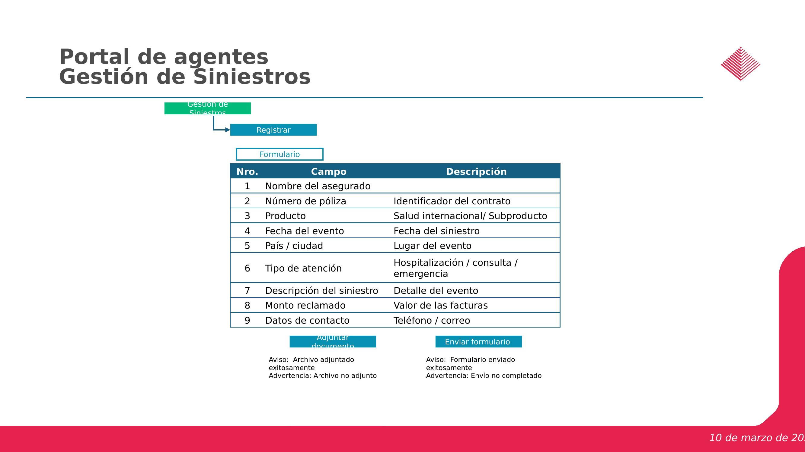
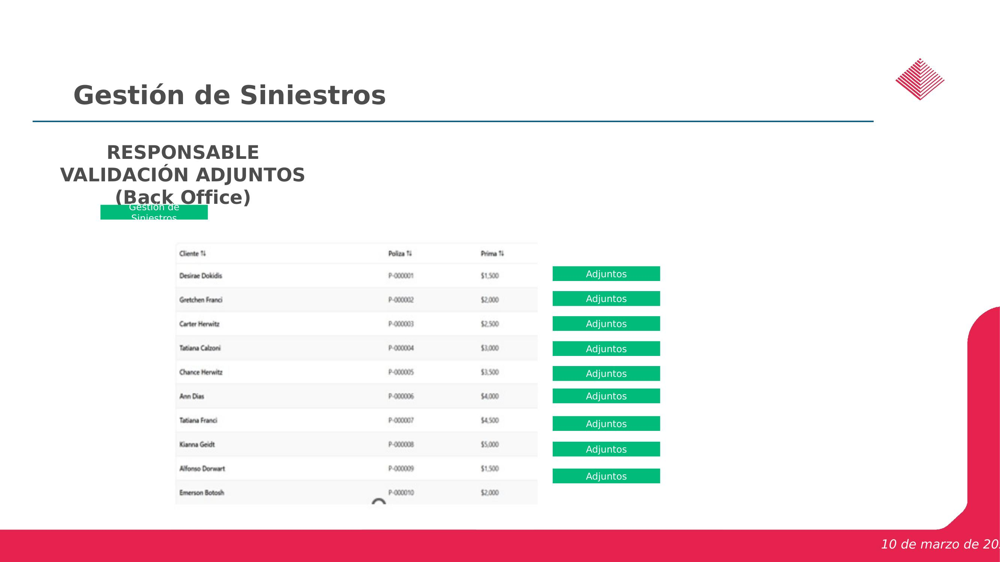
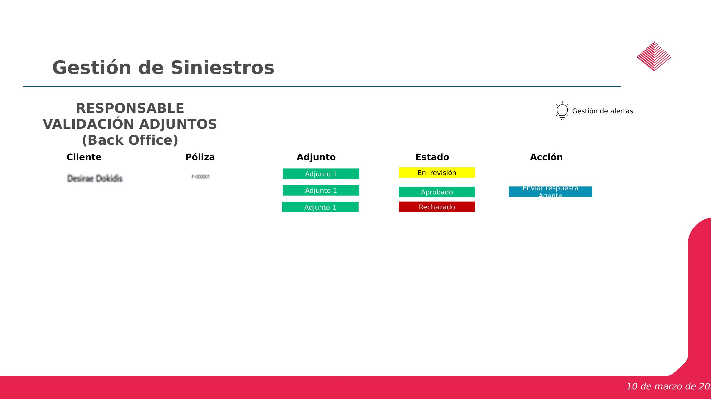
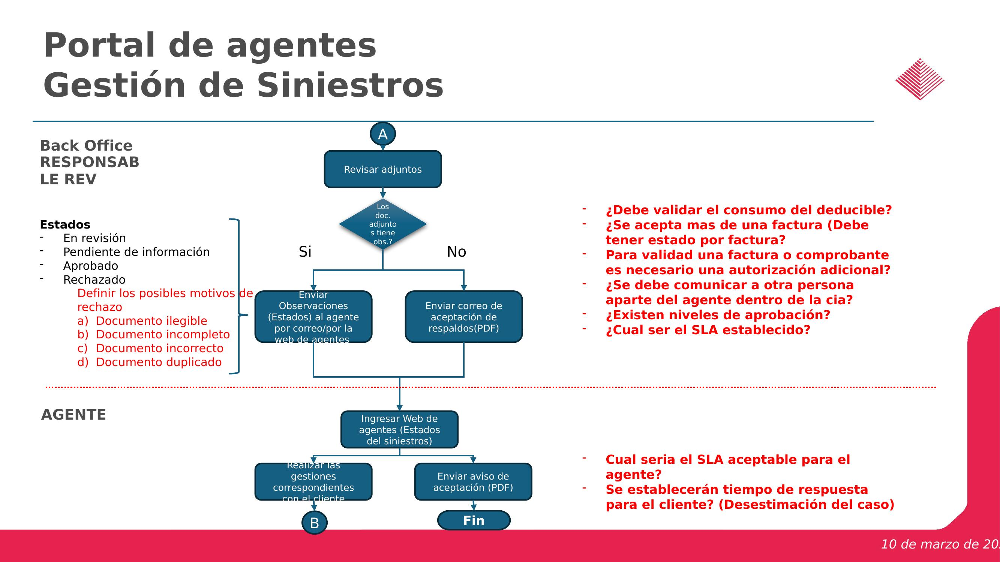
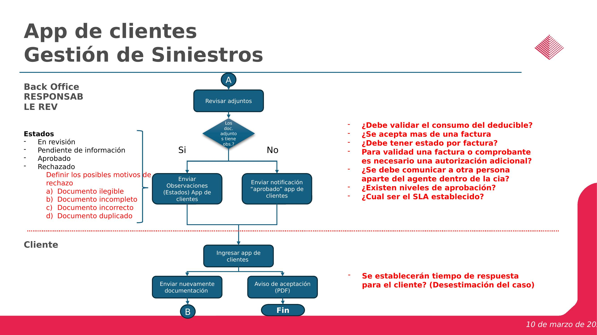

# Plan de Implementacion - Sprint 9: Modulo de Siniestros

**Proyecto:** BISA Seguros - Salud Internacional
**Sprint:** 9 - Modulo de Siniestros
**Periodo:** 23 de marzo 2026 - 16 de abril 2026 (19 dias habiles)
**Equipo:** Equipo Xiobit
**Objetivo:** Gestion de siniestros para Web de Agentes y App de Clientes

---

## 1. Resumen Ejecutivo

El Sprint 9 implementa el modulo completo de Gestion de Siniestros, que permite a los agentes (via portal web) y a los clientes (via app movil) registrar reclamos de siniestros de salud internacional, adjuntar documentacion de respaldo, y dar seguimiento al estado de cada caso. El Back Office revisa, aprueba o rechaza cada siniestro con observaciones.

El sprint se divide en **5 epicas principales**:

| # | Epica | Periodo | Dias |
|---|-------|---------|------|
| 61 | Web de Agentes - Gestion de Siniestros | Mar 23 - Abr 16 | 19 |
| 62 | App de Clientes - Registro y consulta de siniestros | Mar 23 - Abr 10 | 15 |
| 63 | Backend / Modulo de siniestros + Integracion Freshdesk | Mar 23 - Abr 10 | 15 |
| 64 | Gestion Back Office | Abr 1 - Abr 10 | 8 |
| 65 | Seguridad y cumplimiento | Abr 8 - Abr 16 | 7 |

---

## 2. Arquitectura del Flujo de Siniestros

### 2.1 Flujo General - Portal de Agentes

El flujo principal del portal de agentes sigue estos pasos:

1. **Cliente** envia respaldos del siniestro (facturas u otros) al agente
2. **Agente** ingresa al portal web, busca al cliente por nombre o poliza
3. **Agente** llena el formulario de gestion de siniestros y adjunta documentos
4. **Responsable de Revision (Back Office)** revisa los adjuntos
5. Si hay observaciones, se envian al agente por correo/web
6. Si se aceptan, se envia correo de aceptacion (PDF)
7. **Agente** consulta estados del siniestro en la web



### 2.2 Flujo General - App de Clientes

El flujo para la app de clientes es similar pero directo:

1. **Cliente** ingresa a la app y selecciona "Gestion de Siniestros"
2. **Cliente** llena el formulario y sube los adjuntos
3. **Responsable de Revision** revisa los adjuntos
4. Se envian observaciones o notificacion de aprobado via app
5. **Cliente** puede reenviar documentacion si fue observada



### 2.3 Estados del Siniestro

El ciclo de vida de un siniestro tiene los siguientes estados:

- **Registrado** - Siniestro recien creado
- **En revision** - Back Office esta revisando los adjuntos
- **Pendiente de informacion** - Se requiere documentacion adicional
- **Aprobado** - Siniestro aceptado
- **Rechazado** - Siniestro rechazado (con motivo)

### 2.4 Motivos de Rechazo

- Documento ilegible
- Documento incompleto
- Documento incorrecto
- Documento duplicado

---

## 3. Mockups de Interfaz de Usuario

### 3.1 Dashboard del Portal de Agentes con acceso a Siniestros

El menu lateral del portal de agentes incluye una nueva opcion "Gestion de siniestros". Desde el dashboard se puede acceder directamente al modulo.



### 3.2 Listado de Clientes con Estado de Siniestros

Pantalla que muestra la lista de clientes con sus polizas y un enlace a "Gestion de Siniestros" por cliente, incluyendo badges de estado (Aprobado, Pendiente, Rechazado).



### 3.3 Formulario de Registro de Siniestro

El formulario de registro contiene los siguientes campos:

| Nro | Campo | Descripcion |
|-----|-------|-------------|
| 1 | Nombre del asegurado | Nombre completo del asegurado |
| 2 | Numero de poliza | Identificador del contrato |
| 3 | Producto | Salud Internacional / Subproducto |
| 4 | Fecha del evento | Fecha del siniestro |
| 5 | Pais / Ciudad | Lugar del evento |
| 6 | Tipo de atencion | Hospitalizacion / Consulta / Emergencia |
| 7 | Descripcion del siniestro | Detalle del evento |
| 8 | Monto reclamado | Valor de las facturas |
| 9 | Datos de contacto | Telefono / Correo |

Incluye seccion de **adjuntar documentos** (obligatorios y complementarios) y boton de **enviar formulario** con mensajes de confirmacion/error.



### 3.4 Vista Back Office - Lista de Siniestros con Adjuntos

El responsable de validacion de adjuntos ve una lista de clientes con polizas y acceso directo a los adjuntos de cada siniestro.



### 3.5 Vista Back Office - Detalle de Revision por Adjunto

Cada siniestro se revisa adjunto por adjunto. El responsable puede cambiar el estado de cada adjunto (En revision, Aprobado, Rechazado) y enviar respuesta al agente. Incluye acceso a "Gestion de alertas".



### 3.6 Flujo de Decision del Back Office

El proceso de revision incluye validacion de adjuntos con bifurcacion Si/No para observaciones, gestion de motivos de rechazo, y envio de correos de aceptacion o rechazo.





---

## 4. Plan de Tareas Detallado

### 4.1 Epica 61: Web de Agentes - Gestion de Siniestros (Mar 23 - Abr 16)

#### Fase 1: Diseno (Mar 23 - Mar 27)

| Tarea | Inicio | Fin | Dias |
|-------|--------|-----|------|
| Definir alcance app clientes | Mar 23 | Mar 25 | 3 |
| Diseno pantalla registro | Mar 23 | Mar 25 | 3 |
| Diseno pantalla estado | Mar 25 | Mar 27 | 3 |
| Diseno carga documentos | Mar 25 | Mar 27 | 3 |

**Entregables de diseno:**
- Wireframes finales de pantalla de registro de siniestro (formulario + adjuntos)
- Wireframes de pantalla de listado/estado de siniestros
- Wireframes del componente de carga de documentos (drag & drop, preview, validaciones)
- Definicion de estados visuales (badges de color por estado)

#### Fase 2: Desarrollo Frontend (Mar 30 - Abr 9)

| Tarea | Inicio | Fin | Dias |
|-------|--------|-----|------|
| Crear formulario siniestro | Mar 30 | Abr 2 | 4 |
| Carga documentos | Mar 30 | Abr 2 | 4 |
| Validacion asegurado | Abr 1 | Abr 3 | 3 |
| Validacion poliza | Abr 1 | Abr 3 | 3 |
| Registro siniestro | Abr 2 | Abr 7 | 4 |
| Consulta siniestros | Abr 2 | Abr 7 | 4 |
| Consulta detalle siniestro | Abr 6 | Abr 8 | 3 |
| Visualizacion respuesta | Abr 6 | Abr 8 | 3 |
| Notificaciones push | Abr 7 | Abr 9 | 3 |
| Notificaciones correo | Abr 7 | Abr 9 | 3 |

**Detalle tecnico por tarea:**

**Crear formulario siniestro:**
- Componente Angular reactive form con los 9 campos definidos
- Validaciones: campos obligatorios, formato fecha, monto numerico, email valido
- Autocompletado de campos 1-3 al seleccionar cliente/poliza
- Selector de tipo de atencion (dropdown: Hospitalizacion, Consulta, Emergencia)

**Carga documentos:**
- Componente de upload con drag & drop
- Clasificacion de documentos: obligatorios vs complementarios
- Validaciones: tipo de archivo (PDF, JPG, PNG), tamano maximo
- Preview de archivos adjuntados
- Mensajes de exito/error: "Archivo adjuntado exitosamente" / "Archivo no adjunto"

**Validacion asegurado:**
- Busqueda por nombre o numero de poliza
- Verificar que el asegurado existe en el sistema
- Mostrar datos del asegurado para confirmacion

**Validacion poliza:**
- Verificar vigencia de la poliza
- Verificar cobertura del tipo de siniestro
- Mostrar datos de la poliza (producto, estado, prima)

**Registro siniestro:**
- Envio del formulario completo + adjuntos al backend
- Mensaje de confirmacion: "Formulario enviado exitosamente" / "Envio no completado"
- Asignacion automatica de estado "Registrado"

**Consulta siniestros:**
- Listado de siniestros por cliente con columnas: Cliente, Poliza, Prima, Siniestros, Estado
- Badges de color por estado (verde=Aprobado, amarillo=Pendiente, rojo=Rechazado)
- Filtros y busqueda

**Consulta detalle siniestro:**
- Vista detallada del siniestro con todos los campos del formulario
- Lista de adjuntos con estado individual
- Historial de cambios de estado

**Visualizacion respuesta:**
- Mostrar observaciones del Back Office
- Mostrar motivo de rechazo si aplica
- Opcion de reenviar documentacion

**Notificaciones push y correo:**
- Notificacion al agente cuando cambia el estado del siniestro
- Templates de correo: observaciones, aceptacion (PDF), rechazo

#### Fase 3: Pruebas (Abr 10 - Abr 16)

| Tarea | Inicio | Fin | Dias |
|-------|--------|-----|------|
| Pruebas funcionales | Abr 10 | Abr 14 | 3 |
| Pruebas seguridad | Abr 13 | Abr 15 | 3 |
| Pruebas dispositivos | Abr 14 | Abr 16 | 3 |

---

### 4.2 Epica 62: App de Clientes - Registro y Consulta de Siniestros (Mar 23 - Abr 10)

#### Fase 1: Diseno y Definicion (Mar 23 - Mar 27)

| Tarea | Inicio | Fin | Dias |
|-------|--------|-----|------|
| Definir alcance app clientes | Mar 23 | Mar 25 | 3 |
| Definir autenticacion cliente | Mar 23 | Mar 25 | 3 |
| Diseno pantalla registro | Mar 25 | Mar 27 | 3 |
| Diseno pantalla estado | Mar 25 | Mar 27 | 3 |
| Diseno carga documentos | Mar 25 | Mar 27 | 3 |

**Consideraciones especificas de la app:**
- Definir mecanismo de autenticacion del cliente (biometrico, PIN, token)
- Adaptar el formulario de 9 campos a formato movil
- Optimizar carga de documentos para camara del dispositivo (captura directa de fotos)

#### Fase 2: Desarrollo (Abr 1 - Abr 9)

| Tarea | Inicio | Fin | Dias |
|-------|--------|-----|------|
| Crear formulario siniestro | Abr 1 | Abr 3 | 3 |
| Carga documentos | Abr 1 | Abr 3 | 3 |
| Validacion asegurado | Abr 2 | Abr 6 | 3 |
| Validacion poliza | Abr 2 | Abr 6 | 3 |
| Registro siniestro | Abr 3 | Abr 7 | 3 |
| Consulta siniestros | Abr 3 | Abr 7 | 3 |
| Consulta detalle siniestro | Abr 6 | Abr 8 | 3 |
| Visualizacion respuesta BO | Abr 6 | Abr 8 | 3 |
| Notificaciones push | Abr 7 | Abr 9 | 3 |
| Notificaciones correo | Abr 7 | Abr 9 | 3 |

**Diferencias clave vs Web de Agentes:**
- La app del cliente accede directamente (sin intermediario agente)
- Notificaciones push nativas del dispositivo (iOS/Android)
- Interfaz simplificada: el cliente ve su opcion "Gestion de Siniestros" en el menu principal
- Las observaciones llegan via notificacion in-app, no por correo al agente
- El cliente puede reenviar documentacion directamente desde la app

#### Fase 3: Pruebas (Abr 10 - Abr 16)

| Tarea | Inicio | Fin | Dias |
|-------|--------|-----|------|
| Pruebas funcionales | Abr 10 | Abr 14 | 3 |
| Pruebas seguridad | Abr 13 | Abr 15 | 3 |
| Pruebas dispositivos | Abr 14 | Abr 16 | 3 |

---

### 4.3 Epica 63: Backend / Modulo de Siniestros (Mar 23 - Abr 7)

#### Fase 1: Modelo de Datos (Mar 23 - Mar 31)

| Tarea | Inicio | Fin | Dias |
|-------|--------|-----|------|
| Definir modelo datos siniestros | Mar 23 | Mar 25 | 3 |
| Definir estados siniestro | Mar 23 | Mar 25 | 3 |
| Definir motivos rechazo | Mar 23 | Mar 25 | 3 |
| Definir tipos documentos | Mar 23 | Mar 25 | 3 |
| Crear tabla siniestros | Mar 26 | Mar 31 | 4 |
| Crear tabla documentos | Mar 26 | Mar 31 | 4 |
| Crear tabla historial | Mar 26 | Mar 31 | 4 |
| Crear tabla estados | Mar 26 | Mar 31 | 4 |

**Esquema de Base de Datos propuesto:**

```
siniestros
├── id (PK)
├── numero_siniestro (unique, autogenerado)
├── asegurado_id (FK -> asegurados)
├── poliza_id (FK -> polizas)
├── producto
├── fecha_evento
├── pais
├── ciudad
├── tipo_atencion (enum: hospitalizacion, consulta, emergencia)
├── descripcion
├── monto_reclamado (decimal)
├── telefono_contacto
├── correo_contacto
├── estado (enum: registrado, en_revision, pendiente_info, aprobado, rechazado)
├── agente_id (FK -> agentes, nullable para app clientes)
├── canal_origen (enum: web_agentes, app_clientes)
├── created_at
├── updated_at
└── deleted_at (soft delete)

siniestro_documentos
├── id (PK)
├── siniestro_id (FK -> siniestros)
├── tipo_documento (enum: obligatorio, complementario)
├── nombre_archivo
├── ruta_archivo
├── tamano_archivo
├── mime_type
├── estado (enum: pendiente, aprobado, rechazado)
├── observacion
├── revisado_por (FK -> usuarios)
├── revisado_at
├── created_at
└── updated_at

siniestro_historial
├── id (PK)
├── siniestro_id (FK -> siniestros)
├── estado_anterior
├── estado_nuevo
├── motivo_rechazo (enum, nullable)
├── observaciones (text)
├── usuario_id (FK -> usuarios)
├── created_at
└── ip_address

catalogo_estados
├── id (PK)
├── codigo (unique)
├── nombre
├── descripcion
├── color_badge
├── orden
└── activo (boolean)

catalogo_motivos_rechazo
├── id (PK)
├── codigo (unique)
├── nombre
├── descripcion
└── activo (boolean)

catalogo_tipos_documento
├── id (PK)
├── codigo (unique)
├── nombre
├── obligatorio (boolean)
├── extensiones_permitidas
└── tamano_maximo_mb
```

#### Fase 2: APIs REST (Mar 31 - Abr 7)

| Tarea | Inicio | Fin | Dias |
|-------|--------|-----|------|
| API registro siniestro | Mar 31 | Abr 3 | 4 |
| API consulta siniestros | Mar 31 | Abr 3 | 4 |
| API carga documentos | Abr 1 | Abr 6 | 4 |
| API actualizacion estado | Abr 1 | Abr 6 | 4 |
| API historial | Abr 2 | Abr 7 | 4 |
| API notificaciones | Abr 2 | Abr 7 | 4 |

**Endpoints propuestos:**

```
POST   /api/v1/siniestros                    → Registrar nuevo siniestro
GET    /api/v1/siniestros                    → Listar siniestros (con filtros, paginacion)
GET    /api/v1/siniestros/:id                → Detalle de un siniestro
PATCH  /api/v1/siniestros/:id/estado         → Actualizar estado (Back Office)

POST   /api/v1/siniestros/:id/documentos     → Subir documento(s)
GET    /api/v1/siniestros/:id/documentos     → Listar documentos del siniestro
GET    /api/v1/siniestros/:id/documentos/:docId → Descargar documento
PATCH  /api/v1/siniestros/:id/documentos/:docId → Actualizar estado documento (BO)

GET    /api/v1/siniestros/:id/historial      → Historial de estados

POST   /api/v1/notificaciones/enviar         → Disparar notificacion (push/email)
GET    /api/v1/notificaciones                → Listar notificaciones del usuario

GET    /api/v1/catalogos/estados-siniestro   → Catalogo de estados
GET    /api/v1/catalogos/motivos-rechazo     → Catalogo motivos de rechazo
GET    /api/v1/catalogos/tipos-documento     → Catalogo tipos de documento
```

---

### 4.4 Epica 63b: Integracion con Freshdesk (Abr 6 - Abr 10)

| Tarea | Inicio | Fin | Dias |
|-------|--------|-----|------|
| Definir estructura ticket | Abr 6 | Abr 7 | 2 |
| Definir cola siniestros | Abr 6 | Abr 7 | 2 |
| API creacion ticket | Abr 7 | Abr 9 | 3 |
| Adjuntar documentos ticket | Abr 7 | Abr 9 | 3 |
| Actualizar estado ticket | Abr 8 | Abr 10 | 3 |
| Obtener estado ticket | Abr 8 | Abr 10 | 3 |
| Notificaciones cambio estado | Abr 9 | Abr 10 | 2 |
| Pruebas integracion | Abr 13 | Abr 16 | 4 |

**Detalle de integracion:**
- Cada siniestro registrado crea automaticamente un ticket en Freshdesk
- Los documentos adjuntos se vinculan al ticket
- Cambios de estado en Freshdesk se sincronizan de vuelta al sistema (webhook o polling)
- Cola dedicada "Siniestros" en Freshdesk para segmentacion
- Mapeo de estados: Registrado→Open, En revision→Pending, Pendiente info→Waiting on Customer, Aprobado→Resolved, Rechazado→Closed

---

### 4.5 Epica 64: Gestion Back Office (Abr 1 - Abr 10)

| Tarea | Inicio | Fin | Dias |
|-------|--------|-----|------|
| Definir flujo revision | Abr 1 | Abr 2 | 2 |
| Definir responsables | Abr 1 | Abr 2 | 2 |
| Definir SLA | Abr 1 | Abr 2 | 2 |
| Pantalla revision BO | Abr 3 | Abr 7 | 3 |
| Subida respuesta | Abr 3 | Abr 7 | 3 |
| Registro motivo rechazo | Abr 6 | Abr 9 | 4 |
| Solicitud info adicional | Abr 6 | Abr 10 | 5 |

**Funcionalidades de la pantalla Back Office:**
- Lista de siniestros asignados al responsable (filtrable por estado)
- Vista de cliente con poliza y listado de adjuntos
- Revision adjunto por adjunto con cambio de estado individual
- Accion "Enviar respuesta al Agente" con observaciones
- Registro de motivo de rechazo (seleccion de catalogo + observacion libre)
- Solicitud de informacion adicional que cambia estado a "Pendiente de informacion"
- Gestion de alertas para SLA vencidos

**Preguntas de negocio a resolver (del mockup):**
- Debe validarse el consumo del deducible?
- Se acepta mas de una factura por siniestro? Debe tener estado por factura?
- Para validar una factura, es necesaria una autorizacion adicional?
- Se debe comunicar a otra persona aparte del agente dentro de la compania?
- Existen niveles de aprobacion?
- Cual es el SLA establecido?
- Cual es el SLA aceptable para el agente?
- Se estableceran tiempos de respuesta para el cliente? (Desestimacion del caso)

---

### 4.6 Epica 65: Seguridad y Cumplimiento (Abr 8 - Abr 16)

| Tarea | Inicio | Fin | Dias |
|-------|--------|-----|------|
| Definir roles acceso | Abr 8 | Abr 9 | 2 |
| Control acceso documentos | Abr 8 | Abr 10 | 3 |
| Proteccion datos sensibles | Abr 9 | Abr 13 | 3 |
| Registro auditoria | Abr 10 | Abr 14 | 3 |
| Terminos y condiciones | Abr 13 | Abr 15 | 3 |
| Escaneo vulnerabilidades | Abr 14 | Abr 16 | 3 |

**Detalle:**

**Roles de acceso:**
- Agente: registrar siniestros, consultar sus siniestros, ver respuestas
- Cliente: registrar siniestros propios, consultar sus siniestros
- Responsable de Revision (BO): revisar adjuntos, cambiar estados, enviar observaciones
- Administrador: gestion de catalogos, reportes, configuracion SLA

**Control acceso documentos:**
- Los documentos solo son visibles para el agente/cliente que los subio y el equipo de Back Office
- URLs de descarga con tokens temporales (signed URLs)
- No se permite acceso directo a archivos por ruta

**Proteccion datos sensibles:**
- Encriptacion de datos personales en reposo
- Sanitizacion de archivos subidos (antivirus, validacion de tipo real)
- Enmascaramiento de datos sensibles en logs

**Registro auditoria:**
- Log de todas las acciones: registro, cambio estado, descarga documento, etc.
- Campos: usuario, accion, timestamp, IP, datos antes/despues

---

## 5. Dependencias entre Epicas

```
Semana 1 (Mar 23-27):
  [61-Diseno] ──────────────────┐
  [62-Diseno] ──────────────────┤
  [63-Modelo Datos] ────────────┘

Semana 2 (Mar 30 - Abr 3):
  [61-Frontend] ◄── [63-APIs] (necesita endpoints)
  [62-App Dev] ◄─── [63-APIs] (mismos endpoints)

Semana 3 (Abr 6-10):
  [63b-Freshdesk] ◄── [63-APIs] (usa servicios del backend)
  [64-Back Office] ◄── [63-APIs] + [63-Modelo Datos]
  [65-Seguridad] ◄── todo lo anterior

Semana 4 (Abr 13-16):
  [Pruebas integrales] ◄── todas las epicas
```

**Dependencias criticas:**
- El backend (Epica 63) es prerequisito para el desarrollo frontend de ambas plataformas
- El modelo de datos debe estar definido antes de crear las APIs
- La integracion con Freshdesk depende de que las APIs de siniestros esten operativas
- Las pruebas de seguridad requieren que todas las funcionalidades esten implementadas

---

## 6. Riesgos y Mitigaciones

| Riesgo | Impacto | Mitigacion |
|--------|---------|------------|
| Preguntas de negocio sin resolver (deducible, niveles aprobacion, SLA) | Alto | Agendar reunion con stakeholders la primera semana para definir reglas de negocio |
| Integracion Freshdesk con demoras | Medio | Implementar primero flujo completo sin Freshdesk, luego integrar como capa adicional |
| Carga de documentos con archivos grandes | Medio | Implementar upload chunked, limites de tamano, compresion de imagenes |
| Sincronizacion de estados entre sistema y Freshdesk | Alto | Implementar mecanismo de retry y cola de eventos para evitar inconsistencias |
| Pruebas en multiples dispositivos iOS/Android | Medio | Priorizar dispositivos mas usados segun analytics existentes |

---

## 7. Criterios de Aceptacion

### Registro de Siniestro
- El agente/cliente puede registrar un siniestro con los 9 campos del formulario
- Se pueden adjuntar documentos obligatorios y complementarios
- Se valida vigencia de poliza y existencia del asegurado
- Se genera numero de siniestro unico
- Se crea ticket automaticamente en Freshdesk

### Consulta de Siniestros
- El agente/cliente puede ver la lista de sus siniestros con estados visuales
- Puede acceder al detalle de cada siniestro
- Puede ver el historial de estados y observaciones del BO

### Gestion Back Office
- El responsable puede ver lista de siniestros pendientes
- Puede revisar cada adjunto individualmente
- Puede aprobar, rechazar (con motivo) o solicitar informacion adicional
- Las notificaciones se envian correctamente al agente/cliente

### Seguridad
- Los roles de acceso estan implementados y probados
- Los documentos solo son accesibles por usuarios autorizados
- Existe registro de auditoria completo
- Se realizo escaneo de vulnerabilidades sin hallazgos criticos

---

## 8. Stack Tecnologico

| Componente | Tecnologia |
|-----------|------------|
| Web de Agentes | Angular (aplicacion web existente) |
| App de Clientes | iOS nativo + Android nativo (apps existentes) |
| Backend / APIs | Stack actual del proyecto (definido en sprints anteriores) |
| Base de Datos | Base de datos actual del proyecto |
| Almacenamiento de archivos | Cloud storage (S3/equivalente) con signed URLs |
| Notificaciones push | Firebase Cloud Messaging (FCM) / APNs |
| Notificaciones email | Servicio de email transaccional existente |
| Ticketing | Freshdesk API v2 |
| Autenticacion | Sistema de auth existente del portal/app |
